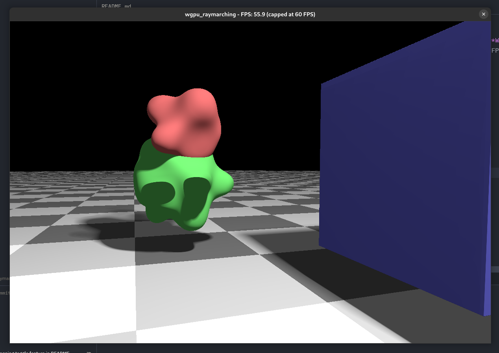

# WGPU Raymarcher

A **raymarcher** built with [wgpu](https://github.com/gfx-rs/wgpu), written in **Rust** and **WGSL**. This project is a work in progress, exploring the raymarching technique. FPS capping can be toggled by pressing `F`.

This repo is available on both [GitHub](https://github.com/wesfly/wgpu-raymarcher) and [Codeberg](https://codeberg.org/wesfly/wgpu_raymarching).



## Features

- Light and Shadow
- Camera controls
- Animated movement
- Smooth blending between objects
- FPS capping

## Installation

1. Clone the repository:

   ```bash
   git clone https://github.com/wesfly/wgpu-raymarcher.git
   cd wgpu-raymarcher
   ```

2. Run the application:

   ```bash
   cargo run
   ```

## Thanks to

- [learn-wgpu](https://github.com/sotrh/learn-wgpu): Learning resources by Ben Hansen
