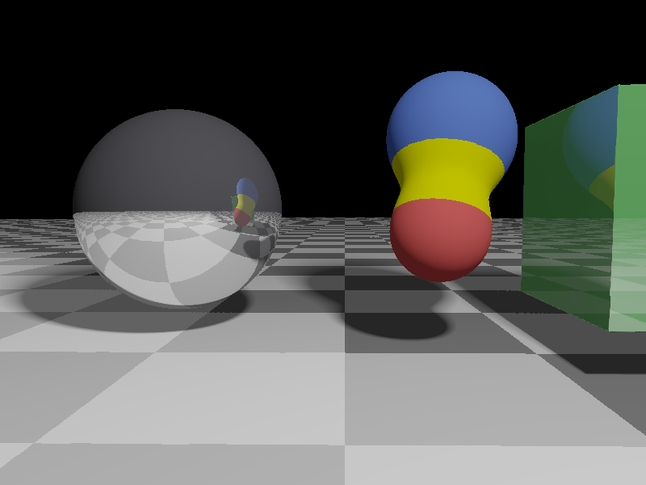

# WGPU Raymarcher

A real-time interactive **raymarching renderer** built with [wgpu](https://github.com/gfx-rs/wgpu), written in **Rust** and **WGSL**. This project demonstrates distance field rendering techniques through raymarching.



## About Raymarching

Raymarching is a rendering technique that creates 3D scenes by "marching" along a ray until hitting a surface defined by mathematical distance functions. This approach enables complex visual effects that would be difficult to achieve with traditional polygon rendering.

## Features

- **Interactive Camera Control**: Rotate the camera by clicking and dragging the mouse
- **Distance Field Primitives**: Spheres, boxes, and planes with smooth blending
- **Dynamic Lighting & Shadows**: Soft shadows and diffuse lighting
- **Material System**: Different materials with unique visual properties
- **Animated Objects**: Dynamic movement of scene elements
- **Customizable Performance**: Toggle FPS capping with the `F` key
- **User-Controlled Movement**: Control object position using W/S keys

## Technical Details

- Built with **wgpu** for cross-platform GPU access
- Shader code written in **WGSL** (WebGPU Shading Language)
- Leverages **Signed Distance Fields** (SDFs) for scene representation
- Implements smooth object blending with special material transitions
- Uses efficient ray marching with adaptive stepping

## Installation

1. Clone this repository:

   ```bash
   git clone https://github.com/wesfly/wgpu-raymarcher.git
   cd wgpu-raymarcher
   ```

2. Ensure you have Rust and Cargo installed, then run:

   ```bash
   cargo run --release
   ```

## Controls

- **Mouse Drag**: Rotate camera
- **W/S Keys**: Move the green box forward/backward
- **F Key**: Toggle FPS cap
- **ESC**: Exit the application

## Acknowledgements

- [learn-wgpu](https://github.com/sotrh/learn-wgpu): For excellent WGPU learning resources
- [Inigo Quilez](https://iquilezles.org/): For pioneering work in signed distance fields

## License

This project is available under the GNU General Public License.

---

This repo is available on both [GitHub](https://github.com/wesfly/wgpu-raymarcher) and [Codeberg](https://codeberg.org/wesfly/wgpu_raymarching).
